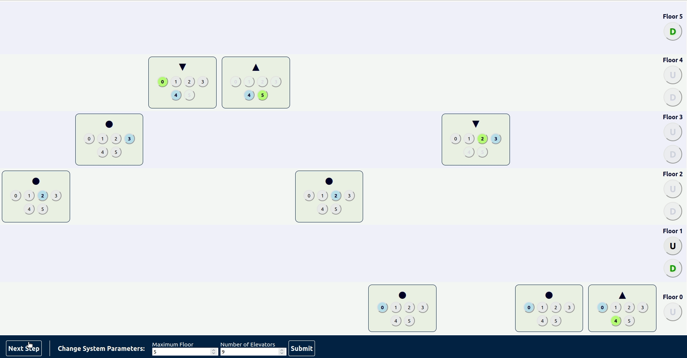

# System kontroli wind w budynku

## Uruchomienie
### Uruchomienie servera
```
cd server/
```
```
mvn spring-boot:run
```
### Uruchomienie klienta
```
cd client/
```
```
npm install && npm start
```
aplikacja pownna być dostępna na: http://localhost:3000/

## Zasady działania systemu

### przebieg tury symulacji
- windy poruszają się o co najwyżej jedno piętro w dół/góre zgodnie z algorytmem, przed startem zakmytają dżwi
- jeżeli piętro na które przyjchaliśmy jest celem pasażera lub jest na nim zgłoszenie które winda może odebrać to otwieramy drzwi i wypuszczamy/wpuszczamy pasażerów
- użytkownicy mogą wzywać windy i ustawiać cele
- przechodzimy do następnej tury.

### Założenia
1. każda winda posiada zestaw przycisków dzięki którym pasażerowie ustalają cel windy
2. raz ustalonego celu nie da się wyłączyć
3. windy przywołujemy na poziomie piętra, deklarując jednocześnie kierunek jazdy (góra/dół)
4. każda winda ma wskaźnik informujący jaki rodzaj pasażerów może do niej wsiąść - (góra/dół/dowolne/żadne)
5. w windach można dodawać cele zgodne ze wskazaniem wskaźnika
6. jeżeli na piętrze jest otwarta winda, to nie da się się zgłosić chęci jazdy zgodnym ze wskaźnikiem windy - trzeba skorzystać z otwartej.

#### Odporność na złośliwych użytkowników
system, żeby działać sprawnie wymaga stosowania się do oznaczeń. Jednak użytkownicy nie będą mogli "porwać" nieprzeznaczonej dla nich windy - przyciski dla celów w złych kierunkach są wyłączone.

### Algorytm
w algorytmie wykożystamy funkcje podającą szacowany czas przybycia windy do celu.

#### Dla każdego zgłoszenia
wybieramy wyndę o najmniejszym szacowany czasie przybycia z pośród:
1. wind jadących w strone zgłoszenia w kierunku zgodnym ze zgłoszonym przez użytkownika.
2. wind bez celu, które po przyjęciu zgłoszenia poruszałyby się w kierunku zgodnym ze zgłoszonym przez użytkownika.
3. wind bez celu, które po przyjęciu zgłoszenia poruszałyby się w kierunku przeciwnym do zgłoszonego przez użytkownika.

W przypadku punktów 1 i 2 możemy dopisać się do listy celów windy, a winda będzie w stanie obsłóżyć wszysktie ewentualne nowe zgłoszenia,
które pojawią się po drodze. <br> W przypadku punktu 3 winda będzie musiała zostać zarezerwowana i jechać prosto na piętro zgłoszenia - jest to opcja którą wybierzemy jedynie jeżeli winda jest blisko piętra zgłoszenia
<br><br>
dodatkowo jeżeli zgłoszenie pojawia się na parterze lub piętrze 0 możemy wszystkie bezczynne windy traktować jak w punkcjie 2
<br>
zgłoszenia przeglądane są w kolejności składania.
##### Jeżeli nie znajdziemy windy, którą możemy przypisać do zgłoszenia w powyższy sposób
Jeżeli zgloszenie czekało wystarczająco długo (dłużej od sredniego czasu oczekiwania zleceń) to traktujemy je priorytetowo.
Wybieramy windę która najszybciej osiągnie swój cel i wróci do piętra zgłoszenia - po osiągnięciu wszystkich celów (ustawionych aktualnie i tych które pojawią się przy odbiorze zleceń aktualnie przypisanych do windy)
winda jest przywoływana bezpośrednio na piętro zgłosznie

##### funkcje kosztów dla powyższych punktów
* punkty 1 i 2 - liczba pięter pomiędzy windą a zgłoszeniem
* punkt 3 - liczba pięter pomiędzy windą a zgłoszeniem pomniejszona o 1, a później przemnożona o stałą większą od 1 - koszt będzie rósł szybko wraz ze wrostem różnicy pięter.
* przypadek priorytetowy - długość ścieżki: winda -> koniec budynku -> piętro zgłoszenia - jest to najdłuższa możliwa liczba tór w jakiej winda obsłuży zgłosznie.

#### Dla każdej windy
winda porusza się w kierunku ustalonych celów

#### Cechy algorytmu
* po wejściu do windy pasażerowie dojadą do celu w najmniejszej możliwej liczbie tur
* funkcje kosztów mogą być modyfikowane aby lepiej dostosować system do konkretnego budynku. Możemy przykładowo:
  * zwiększać wartość kosztu wraz z ilością pięter na których winda się zatrzyma
  * dodatkowy kozt dla startu bezczynnej windy
  * dodatkowy koszt dla jazdy w góre
* czas po którym zgłoszenie zostanie potraktowane priorytetowo może być modyfikowane aby lepiej dostosować system do konkretnego budynku.
* algorytm będzie grupował użytkowników jadących w tym samym kierunku, zwiększając wydajność.
* algorytm nie pozwoli na zagłodzenie zgłoszenia.

## Wizualizacja systemu

#### Oznacznia wind
* zielone tło - winda otwarta
* szare tło - winda zarezerwowana
* niebieskie tło - winda zamknięta
* znaczniki:
  * trójkąt skierowany do góry - winda jedzie do góry
  * trójkąt skierowany do dołu - winda jedzie na dół
  * koło - winda jest bezczynna, może jechac w dowolną strone
  * krzyż - winda zarezerwowana
* przyciski:
  * zielone - wybrane cele
  * niebieski - aktualne piętro
  * szary - możliwy do ustawiania
  * bladoniebieski z bladą czcionką - nieaktywny 

#### Sterowanie systemem
odbywa się za pomocą przycisków w windach ustawiających cele windy oaraz przycisków zgłoszeń na każdym z piętr.

#### Rezultat


## Interfejs systemu

``` java
public interface IElevatorSystem {
    // next setep in the simulation
    void nextStep();

    // gets the state of the system,
    ElevatorSystemState getState();

    // new request to go up from a floor
    boolean newUpRequest(Integer floor);

    // new request to go down from a floor
    boolean newDownRequest(Integer floor);

    // new destination for elevator
    boolean newElevatorDestination(Integer elevatorId, Integer destinationFloor);
}
```
Stan systemu jest reprezentowany przez klase:
```java
public class ElevatorSystemState {
    // number of elevators in the system
    private final Integer elevatorCount;
    // max floor in the system
    private final Integer maxFloor;
    // list of floors with an active up request
    private final List<Integer> upRequests;
    // list of floors with an active down request
    private final List<Integer> downRequests;
    // list of elevators' current floors
    private final List<Integer> elevatorFloors;
    // list representing states of elevators' doors
    private final List<Boolean> openElevators;
    // list of elevators' current directions
    private final List<Integer> elevatorDirections;
    // list representing elevators' reserved status
    private final List<Boolean> reservedElevators;
    // list of elevators' current destinations
    private final List<List<Integer>> elevatorDestinations;
}
```

## Endpointy
```
GET     /elevators                            pobiera stan systemu
PATCH   /elevators                            przenaosi system do następnej tury i pobiera jego stan po zmianie
PUT     /elevators/maxFloor/elevatorCount     ustawia nowe parametry systemu i pobiera jego stan po zmianie

PUT     /destination/elevatorId/destination   dodaje nowy cel do wskazanej windy
PUT     /request/floor/direction              dodaje nowy request na wskazanym piętrze
```
